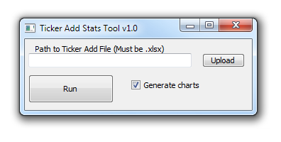

# TickerAddStats
Tool that tracks stats for ticker adds by analyst

## Development

### Background
Maria has asked for a tool that imports a .xlsx file (see analysttickers.xlsx) and calculates daily/weekly/monthly ticker adds by analyst. She would like to run the tool whenever she gets a new file to input with updated ticker adds. 

### Input
You should assume that the input file structure would be identical to analysttickers.xlsx. 

### Output
The output should be a table that has the ticker adds for each analyst for the given time period. The daily table should have these for each day in the range of dates, the weekly table should have these for each week in the range, and the monthly table should have these for each month in the range. It would be nice to have a figure output as well that visualizes these ticker adds for each analyst. 

### Interface
The tool should be a GUI that accepts the input file or use the path of the input file as a command line argument. If in BQNT, you can store the file in the same folder is the notebook, but ensure that the tool can accept different files without altering the code. 

I have coded up a quick example to get someone started for a possible interface. This interface accepts a file or path name with the statistics and allows the user to select whether they would like charts in addition to a tabular output. Here is screenshot of the interface:

### Timeline
I am envisioning this to take about a few hours, given experience. I can get someone started on this if they want to take it the rest of the way. 

## Functionality

Once started, document the actual functionality of the tool here and address deviations from the general expectations outlined above. 
